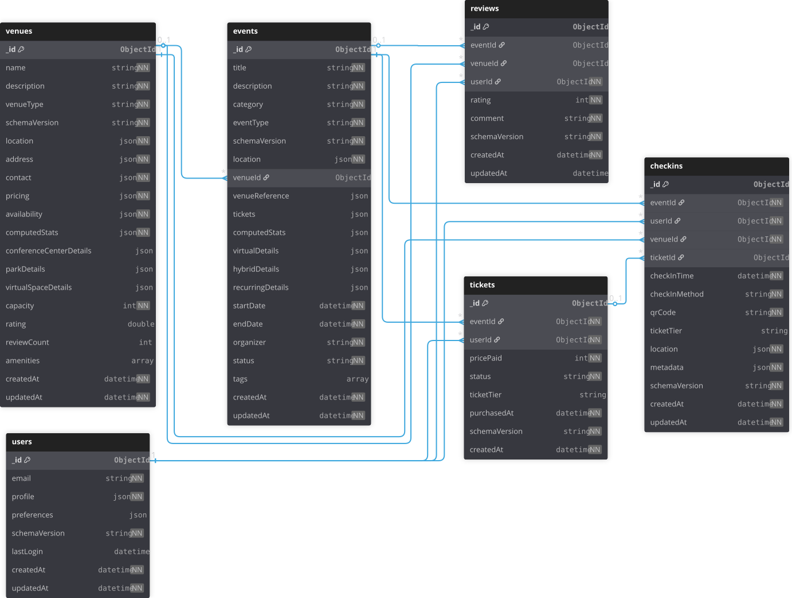
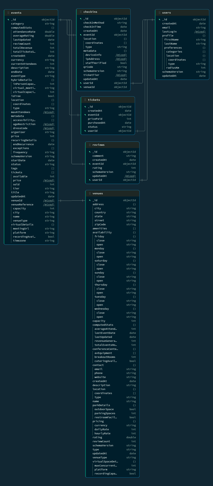

# **Event***Sphere*: MongoDB Event Management System
## Database Design

**Student ID:** 664 870 797  
**Student Name:** Chris Lawrence  
**Course:** CSCI 485 - Topics in Computer Science (MongoDB/NoSQL)  
**Section:** F25N01   
**Instructor:** Dr. Kawal Jeet  
**Submission Date:** November 30, 2025

---

## Summary

EventSphere is a MongoDB-based event management system that demonstrates advanced NoSQL database concepts through real-world application design. The system enables users to discover, review, and attend in-person, virtual, and hybrid events with geospatial discovery, full-text search, and index-optimized analytics capabilities.

This document focuses on the database design rationale, including Entity-Relationship diagram, Collection-Relationship diagram, and detailed explanations of the design patterns and architectural decisions that shaped the database structure.

**Note**: 
- For complete schema validation rules, see [`create_collections.js`](../database/schemas/create_collections.js). 

- For index definitions, see [`create_indexes.js`](../database/indexes/create_indexes.js). 

- For query examples, see [`geospatial_aggregations.js`](../queries/aggregations/geospatial_aggregations.js), [`text_search_aggregations.js`](../queries/aggregations/text_search_aggregations.js), [`date_range_aggregations.js`](../queries/aggregations/date_range_aggregations.js), and [`analytics_aggregations.js`](../queries/aggregations/analytics_aggregations.js).

---

## Entity-Relationship Diagram (ERD)


### ERD Design Notes
NN refers to not nullable fields.

The ERD represents the logical data model before MongoDB-specific optimizations. Key relationships:

| Relationship | Type | Description |
|--------------|------|-------------|
| Venue → Events | 1:N | One venue hosts many events |
| User ↔ Events | M:N | Many users attend many events (via Checkins) |
| User → Reviews | 1:N | One user writes many reviews |
| Event → Reviews | 1:N | One event has many reviews |
| Venue → Reviews | 1:N | One venue has many reviews |
| User → Tickets | 1:N | One user purchases many tickets |
| Event → Tickets | 1:N | One event has many ticket purchases |
| Checkin → Ticket | 1:1 (optional) | A checkin may reference a purchased ticket |

---

## Collection-Relationship Diagram (CRD)



### CRD Design Notes

`NN` refers to not nullable fields.

The CRD shows how the logical ERD was transformed into MongoDB collections with strategic denormalization:

| Collection | Document Count | Key Embedding/Reference Decisions |
|------------|----------------|-----------------------------------|
| events | 150,000 | Embeds: tickets array, venueReference. References: venueId |
| venues | 30,000 | Embeds: address, contact, pricing, type-specific details |
| users | 60,000 | Embeds: profile with nested preferences and location |
| tickets | 550,000 | References: eventId, userId |
| checkins | 150,241 | References: eventId, userId, venueId, ticketId (optional) |
| reviews | 149,151 | References: eventId OR venueId (polymorphic), userId |


### MongoDB Collection Diagram Comparison

**Comparison:** An interesting comparison is that the MongoDB Collection Diagram is obviously similar to the CRD. But since MongoDB is reading schema from the database, it nicely displays the polymorphic design pattern in `venues` and `events`, giving a more concrete representation of the data creation.



---

## Advanced Design Patterns

### 1. Polymorphic Design Pattern

**What it is**: A single collection stores documents of different "types" that share a common base structure but have type-specific attributes. A discriminator field (`eventType` or `venueType`) identifies which type each document belongs to.

**Why EventSphere uses it**: Events and venues have diverse characteristics that would be awkward to model with separate collections or nullable fields everywhere.

#### Event Polymorphism

| Event Type | Type-Specific Fields | Real-World Example |
|------------|---------------------|-------------------|
| `inPerson` | Standard venue-based event | Vancouver Food Festival |
| `virtual` | `virtualDetails`: platform, meetingUrl, recordingAvailable, timezone | AI Workshop via Zoom |
| `hybrid` | `hybridDetails`: virtualCapacity, inPersonCapacity, virtualMeetingUrl | Tech Conference with live stream |
| `recurring` | `recurringDetails`: frequency, endRecurrence, exceptions | Monthly Book Club |

**Why this pattern?**
- **Schema flexibility**: New event types can be added without schema migrations
- **Query efficiency**: All events live in one collection with shared indexes
- **Application simplicity**: The polymorphic field drives conditional logic in the application

#### Venue Polymorphism

| Venue Type | Type-Specific Fields | Example |
|------------|---------------------|---------|
| `conferenceCenter` | breakoutRooms, avEquipment, cateringAvailable | Vancouver Convention Centre |
| `park` | outdoorSpace, parkingSpaces, restroomFacilities | Queen Elizabeth Park |
| `restaurant` | Menu details, reservation info | Local restaurant for private events |
| `virtualSpace` | platform, maxConcurrentUsers, recordingCapability | Zoom/Teams virtual venue |
| `stadium` | Seating sections, event facilities | BC Place |
| `theater` | Stage details, seating configuration | Queen Elizabeth Theatre |

**Why this pattern?**
- **Avoid sparse documents**: Without polymorphism, every venue would have nullable fields for all possible venue types (messy and unnecessary in MongoDB).
- **Enable type-specific queries**: "Find conference centers with AV equipment" uses `venueType` + nested field queries
- **Future extensibility**: Adding `coworkingSpace` or `warehouse` types requires no schema changes (just add a new type to the enum).

---

### 2. Extended Reference Pattern

**What it is**: Frequently accessed data from a referenced document is copied (denormalized) into the referencing document to avoid joins ($lookup) on read-heavy operations.

**Why EventSphere uses it**: Event listings are the most common read operation. Users need to see venue name, city, and capacity without querying the venues collection.

**Implementation in Events**:
```javascript
{
  "venueId": ObjectId("..."),        // Full reference for updates etc.
  "venueReference": {                 // Extended reference for read optimization
    "name": "Vancouver Convention Centre",
    "city": "Vancouver",
    "capacity": 2500,
    "venueType": "conferenceCenter"
  }
}
```

**Trade-offs considered**:

| Benefit | Cost |
|---------|------|
| Event listings load in single query | Venue updates require updating all linked events (less frequent than event updates) |
| Enables venue-based filtering without $lookup | Data duplication (acceptable for read-heavy workload like this one) |
| Reduces query complexity in application | Must maintain consistency on venue name/city changes (extra work for the application layer) |

**Why this trade-off is acceptable**:
- Venue names/cities change rarely (maybe once per year)
- Event reads happen thousands of times per day
- The denormalized fields are small (4 fields, ~100 bytes)
- Application layer handles updates to both documents when venue details change

**Queries enabled by this pattern**:
- "Events at parks in Vancouver" - single collection query with `venueReference.venueType` and `venueReference.city`
- "Events at conference centers with capacity > 500" - compound query on embedded fields

---

### 3. Computed Pattern

**What it is**: Pre-calculated statistics are stored directly in documents to avoid expensive aggregation queries on every read.

**Why EventSphere uses it**: A dashboard or analytics page  for an Event organizer needs to show ticket sales, revenue, ratings, and attendance rates. Computing these on every page load would require aggregating across multiple collections.

**Event Computed Statistics**:
```javascript
"computedStats": {
  "totalTicketsSold": 125,
  "totalRevenue": 16875,
  "attendanceRate": 25.0,
  "reviewCount": 8,
  "averageRating": 4.3,
  "lastUpdated": ISODate("2025-10-01T23:16:16.047Z")
}
```

**Venue Computed Statistics**:
```javascript
"computedStats": {
  "totalEventsHosted": 156,
  "averageAttendance": 850,
  "revenueGenerated": 2450000,
  "lastEventDate": ISODate("2025-09-28T23:16:15.999Z"),
  "lastUpdated": ISODate("2025-10-01T23:16:15.999Z")
}
```

**Update strategy**:
- `lastUpdated` field tracks when stats were last recalculated
- Stats can be updated via scheduled background jobs or triggered on write operations (cron job or webhook)
- For demo/academic purposes, stats are pre-computed during data generation

**Why this pattern?**
- **Performance**: This would drop the load time of a dashboard or analytics page drastically.
- **Scalability**: Aggregation cost is spread across writes, not multiplied across reads
- **Single source of truth**: One place to look for event/venue metrics

---

### 4. Bridge Collection Pattern (Checkins)

**What it is**: A dedicated collection that represents a many-to-many relationship, storing the relationship itself along with relationship-specific attributes.

**Why EventSphere uses it**: Users attend many events, events have many attendees. Embedding attendees in events would cause document bloat (1000+ attendee arrays). Embedding events in users has the same problem.

**Checkins as a Bridge Collection**:

```
User ←──── Checkins ────→ Event
              │
              └──→ Venue (denormalized for analytics)
              └──→ Ticket (optional reference/if it's a paid event)
```

**Why not embed attendees in events?**
- MongoDB documents have a 16MB limit
- Large events (NFL games, concerts) could have 50,000+ attendees
- Each attendee addition would rewrite the entire event document
- Attendee queries ("what events has user X attended?") would require scanning all events

**Why not embed events in users?**
- Active users might attend 100+ events per year
- Each event attendance would grow the user document
- User profile queries don't always need attendance history

**Benefits of bridge collection**:
- **Unbounded scaling**: Millions of checkins without affecting event/user document sizes
- **Relationship attributes**: `checkInTime`, `checkInMethod`, `ticketTier`, `qrCode` belong to the relationship, not the entities
- **Flexible analytics**: Easy to answer "peak check-in times", "check-ins by method", "attendance patterns"
- **Unique constraint**: Index on `{eventId: 1, userId: 1}` prevents duplicate check-ins

---

### 5. Dual Ticket Architecture

**What it is**: Two complementary data structures for tickets - embedded ticket types in events, and a separate collection for individual purchases.

**Why EventSphere uses it**: Ticket types (tiers/pricing) are always displayed with events and are bounded (small number of types). Ticket purchases are unbounded and need independent queries so they are stored in a separate collection.

**Embedded EventTickets (in events collection)**:
```javascript
"tickets": [
  { "tier": "Early Bird", "price": 35, "available": 500, "sold": 250 },
  { "tier": "General Admission", "price": 45, "available": 1500, "sold": 800 },
  { "tier": "VIP", "price": 150, "available": 50, "sold": 45 }
]
```

**Separate Tickets Collection (user purchases)**:
```javascript
{
  "eventId": ObjectId("..."),
  "userId": ObjectId("..."),
  "ticketTier": "VIP",
  "pricePaid": 150.00,
  "status": "active",
  "purchasedAt": ISODate("...")
}
```

**Why this architecture?**

| Aspect | Embedded (ticket types) | Separate (purchases) |
|--------|------------------------|---------------------|
| **Size** | Bounded (1-5 items) | Unbounded (millions) |
| **Access pattern** | Always with event | Independent queries |
| **Example query** | "Show event with pricing" | "User's purchased tickets" |
| **Update frequency** | Rarely (pricing changes) | Frequently (each purchase) |

**Industry precedent**: I read that Ticketmaster, Eventbrite, and StubHub use similar patterns - catalog data embedded, and transaction data separate.

---

### 6. Checkin-Ticket Relationship Pattern

**What it is**: Checkins optionally reference tickets, supporting both paid and free event attendance while avoiding data duplication.

**Why EventSphere uses it**: Not all check-ins require tickets. Free events, walk-ins, staff, and volunteers check in without purchasing.

**Pattern implementation**:
- **70% of checkins**: Have `ticketId` linking to purchased ticket
- **30% of checkins**: `ticketId` is null (free events, walk-ins)
- **Denormalized field**: `ticketTier` kept in checkin for quick display

**Why denormalize ticketTier?**
- Displaying check-in lists shouldn't require $lookup to tickets
- Tier doesn't change after purchase (safe to denormalize)
- Only one field duplicated (minimal storage cost)

**Queries enabled**:
- "Which ticket was used for this checkin?" - direct lookup via `ticketId`
- "All checkins for this ticket" - query by `ticketId`
- "Mark ticket as used on checkin" - update ticket status atomically

---

## Embedding vs. Referencing Decisions

A critical NoSQL design choice is when to embed data vs. when to reference it. 

How I made this decision for EventSphere:

### Embedded (denormalized)

| Data | Embedded In | Rationale |
|------|-------------|-----------|
| Ticket types | events.tickets | Bounded (1-5), always accessed with event, rarely changes |
| Venue reference | events.venueReference | High read frequency, small size, enables filtering |
| Address | venues.address | 1:1 relationship, always accessed together |
| Contact info | venues.contact | 1:1 relationship, small size |
| User preferences | users.profile.preferences | 1:1 relationship, user-specific |
| Computed stats | events/venues | Avoids expensive aggregations |

### Referenced (normalized)

| Data | Stored In | Referenced By | Rationale |
|------|-----------|---------------|-----------|
| Ticket purchases | tickets | eventId, userId | Unbounded, needs independent queries |
| Check-ins | checkins | eventId, userId, venueId | M:N relationship, relationship attributes |
| Reviews | reviews | eventId OR venueId, userId | Unbounded per entity, independent queries |
| Full venue data | venues | events.venueId | Updates should happen in one place |
| User data | users | checkins.userId, reviews.userId | Single source of truth |

---

## Indexing Strategy

Strategic indexes are directly influential on query performance. EventSphere uses **24 indexes** (4 per collection) designed for common query patterns.

**Full index definitions**: See [`create_indexes.js`](../database/indexes/create_indexes.js)

### Index Design Rationale

| Collection | Index | Query Pattern Supported |
|------------|-------|------------------------|
| events | `location: "2dsphere"` | Geospatial discovery ("events near me") |
| events | `{title, description, category, tags}: "text"` | Full-text search with relevance |
| events | `{category: 1, startDate: 1}` | "Technology events this weekend" |
| events | `{eventType: 1, startDate: 1}` | "Virtual events next month" |
| venues | `location: "2dsphere"` | Venue discovery for event creation |
| venues | `{venueType: 1, capacity: 1}` | "Conference centers ≥500 capacity" |
| checkins | `{eventId: 1, userId: 1}` (unique) | Prevent duplicate check-ins |
| users | `email` (unique) | Authentication lookups |

### Index Trade-offs

- **Write performance**: Each index adds a storage overhead to the database.
- **Read performance**: Each index improves query performance.

---

## Data Validation

All collections enforce JSON Schema validation at the database level. Key validation rules:

| Validation Type | Example | Purpose |
|-----------------|---------|---------|
| Coordinate bounds | Longitude: -180 to 180 | Prevent invalid geospatial data |
| Required fields | title, category, location for `events` | Data integrity |
| Enum validation | eventType: ["inPerson", "virtual", "hybrid", "recurring"] | Type safety |
| Range validation | rating: 1-5, price: ≥0 | Business rule enforcement |
| Unique indexes | users.email, checkins.{eventId, userId} | Prevent duplicates |

> **Full validation schemas**: See [`database/schemas/create_collections.js`](../database/schemas/create_collections.js)

---

## Schema Versioning

All collections include a `schemaVersion` field to support future schema evolution:

- **Current version**: "1.0" for all collections
- **Migration strategy**: Application can handle multiple versions during transitions
- **Backward compatibility**: Old documents remain readable while new fields are added

---

## Conclusion

The EventSphere database design demonstrates MongoDB expertise through:

- **Strategic embedding**: Denormalizing for read performance where appropriate
- **Reference patterns**: Normalizing for scalability and independent queries
- **Polymorphic design**: Flexible schemas for diverse entity types
- **Computed patterns**: Pre-calculated stats for dashboard performance
- **Bridge collections**: Scalable many-to-many relationships with relationship attributes

These patterns reflect a well thought out and applicable NoSQL design. Similar patterns are used by industry leaders like Airbnb (geospatial), and Eventbrite (event management).
