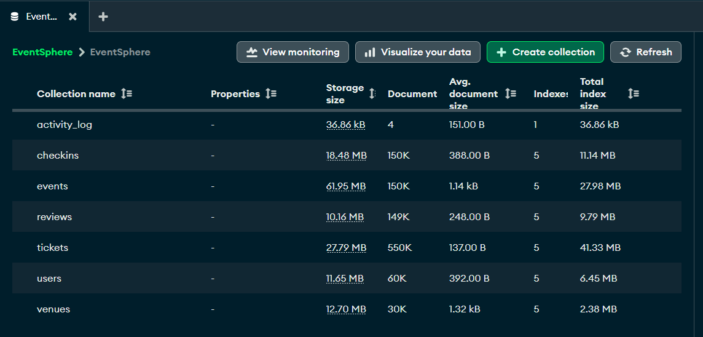

# **Event***Sphere*: MongoDB Event Management System
## Final Project Report

**Student ID:** 664 870 797  
**Student Name:** Chris Lawrence  
**Course:** CSCI 485 - Topics in Computer Science (MongoDB/NoSQL)  
**Section:** F25N01   
**Instructor:** Dr. Kawal Jeet  
**Submission Date:** November 30, 2025  

---

## Table of Contents

1. [Summary](#summary)
2. [Project Overview](#project-overview)
3. [Technical Stack](#technical-stack)
4. [Key Queries and Results](#key-queries-and-results)
5. [How Queries Influenced Database Design](#how-queries-influenced-database-design)
6. [Validation and Aggregation Choices](#validation-and-aggregation-choices)
7. [Performance Analysis](#performance-analysis)
8. [Challenges & Solutions](#challenges--solutions)
9. [Learning Outcomes](#learning-outcomes)
10. [Conclusion](#conclusion)

---

## Summary

[EventSphere Demo Website](https://eventsphere.chrislawrence.ca/)

EventSphere is a MongoDB-based event management system demonstrating advanced NoSQL database concepts through real-world application design. This report focuses on the **query implementations**, **sample results from actual database operations**, and **how query requirements shaped the database design decisions**.

### Key Achievements

| Requirement | Target | Achieved |
|-------------|--------|----------|
| Collections | 4+ | **6** |
| Sample Records | 1000+ | **1,089,392** |
| Queries | 25+ | **30+** |
| Aggregations | 3+ | **6** |
| Indexes | 5+ | **24** |



> **Design Documentation**: For ERD/CRD diagrams and design pattern explanations, see [`database_design.pdf`](../documentation/database_design.pdf).
> 
> **Query Scripts**: For executable MongoDB queries, see [`geospatial_aggregations.js`](../queries/aggregations/geospatial_aggregations.js), [`text_search_aggregations.js`](../queries/aggregations/text_search_aggregations.js), and [`date_range_aggregations.js`](../queries/aggregations/date_range_aggregations.js).
> 
> **Schema Definitions**: For JSON Schema validation rules, see [`create_collections.js`](../database/schemas/create_collections.js)

---

## Project Overview

### Domain Selection Rationale

Event management is ideal for demonstrating MongoDB capabilities because:

1. **Schema Flexibility**: Events have diverse attributes (virtual meetings, recurring schedules, hybrid formats) that would be awkward in rigid relational schemas
2. **Geospatial Requirements**: "Find events near me" is a core feature requiring 2dsphere indexes
3. **Complex Relationships**: Users attend events, events have venues, users write reviews - multiple relationship types
4. **Analytics Requirements**: Revenue tracking, attendance patterns, and category analysis require aggregation pipelines

### Business Requirements Driving Query Design

| Business Need | Query Type | MongoDB Feature Used |
|---------------|------------|---------------------|
| "Events near me" | Geospatial | `$geoNear` with 2dsphere index |
| "Search for tech events" | Full-text search | Text index with weights |
| "Events this weekend" | Date range + location | Compound pipeline |
| "Event attendance stats" | Analytics | `$group`, `$lookup` aggregations |
| "User check-in history" | Relationship traversal | `$lookup` with multiple collections |

---

## Technical Stack

EventSphere uses **Python/Flask** backend with **PyMongo** for MongoDB connectivity, deployed on **MongoDB Atlas**. The frontend uses **Bootstrap 5** and **Leaflet.js** for map visualizations. Query implementations are documented in `app/services.py`, with standalone query scripts in the `queries/` directory.

---

## Key Queries and Results

This section documents the most important queries used in the EventSphere application.

### 1. Geospatial Event Discovery (`$geoNear`)

**Application Use**: Powers the main "Events Near You" feature on the homepage and map interface.

**MongoDB Query** (from `app/services.py` - `EventService.get_events_nearby`):
```javascript
db.events.aggregate([
    {
        $geoNear: {
            near: {
                type: "Point",
                coordinates: [-123.9351, 49.0831]  // Nanaimo coordinates
            },
            distanceField: "distance",
            maxDistance: 50000,  // 50km in meters
            spherical: true
        }
    },
    {
        $limit: 50
    }
])
```

**How it's used in the app**: The `EventService.get_events_nearby()` method accepts user coordinates, converts the radius from km to meters, and returns results as GeoJSON FeatureCollection for map rendering. Results include distance calculations and venue information embedded via the extended reference pattern.

---

### 2. Weekend Events with Location Filter

**Application Use**: Powers a future feature of a "This Weekend" quick filter button, showing events happening Friday 5pm through Sunday 11:59pm within a radius.

**MongoDB Query** :
```javascript
db.events.aggregate([
    {
        $geoNear: {
            near: {
                type: "Point",
                coordinates: [-123.9351, 49.0831]
            },
            distanceField: "distance",
            maxDistance: 50000,
            spherical: true,
            key: "location"
        }
    },
    {
        $match: {
            startDate: {
                $gte: ISODate("2025-11-28T17:00:00Z"),  // Friday 5pm
                $lte: ISODate("2025-11-30T23:59:59Z")   // Sunday midnight
            }
        }
    },
    {
        $sort: { startDate: 1 }
    },
    {
        $limit: 50
    }
])
```

**How it's used in the app**: The aggregation pipeline will be used in the app to filter events by date range and location, returning a list of events that are happening this weekend for the given location.

---

### 3. Full-Text Search with Relevance Scoring

**Application Use**: Powers the search bar functionality on the event detail page, allowing users to search across event titles, descriptions, categories, and tags.

**MongoDB Query** (from `app/services.py` - `EventService.get_events` with search parameter):
```javascript
db.events.find(
    { $text: { $search: "technology workshop" } },
    { score: { $meta: "textScore" } }
).sort(
    { score: { $meta: "textScore" } }
).limit(50)
```

**How it's used in the app**: When the `search` parameter is provided to `get_events()`, the query switches from standard filtering to text search mode. The text index has weighted fields: `title` (weight 10), `category` (weight 5), `tags` (weight 3), and `description` (weight 1), ensuring title matches rank highest in results.

---

### 4. User Attendance History with Lookups

**Application Use**: Powers the future feature of a user profile page showing check-in history with full event and venue details.

**MongoDB Query** :
```javascript
db.checkins.aggregate([
    {
        $match: { userId: ObjectId("...") }
    },
    {
        $lookup: {
            from: "events",
            localField: "eventId",
            foreignField: "_id",
            as: "event"
        }
    },
    {
        $lookup: {
            from: "venues",
            localField: "venueId",
            foreignField: "_id",
            as: "venue"
        }
    },
    { $unwind: "$event" },
    { $unwind: "$venue" },
    { $sort: { checkInTime: -1 } },
    { $limit: 50 },
    {
        $project: {
            _id: 1,
            eventId: 1,
            venueId: 1,
            checkInTime: 1,
            checkInMethod: 1,
            ticketTier: 1,
            event_title: "$event.title",
            event_category: "$event.category",
            venue_name: "$venue.name",
            venue_city: "$venue.address.city"
        }
    }
])
```

**How it's used in the app**: This query will be used in the app to get the attendance history for a user, pulling together checkin records with related event and venue information through multiple `$lookup` stages and `$unwind` operations.

---
---

### 6. Index Performance Analysis

To demonstrate the critical impact of indexes on query performance, this section compares three key index types: geospatial queries using the 2dsphere index, compound index queries for filtered and sorted results, and single-field indexes for simple equality filters. Detailed performance analysis queries can be found in `queries/analysis/index_analysis.js`.

#### Index 1: Geospatial Query (2dsphere Index)

The geospatial query finds events within 50km of a specific location using the `$geoNear` aggregation stage. The 2dsphere index on the `location` field is **required** for this query to function - without it, the query would fail with the following error:

```javascript
planner returned error :: caused by :: unable to find index for $geoNear query
```

The index enables MongoDB to efficiently calculate distances and sort results by proximity.

**Performance Results** (from `explain("executionStats")`):
- **Server Execution Time**: 39ms
- **Documents Examined**: 380 (from 150,000 total)
- **Keys Examined**: 427
- **Documents Returned**: 50 (after `$limit` stage)
- **Index Used**: `location_2dsphere`
- **Index Scan Type**: GEO_NEAR_2DSPHERE

**Analysis**: The 2dsphere index enables efficient geospatial calculations, examining only 380 documents (0.25% of the collection) to find 50 events within 50km. The index uses a two-stage search interval approach, buffering candidates at different distance ranges before returning the closest matches. Without this index, the query would fail entirely, as `$geoNear` requires a 2dsphere index to function.

#### Index 2: Compound Index Query (Category + Date)

The compound index on `(category, startDate)` provides optimal performance for queries that filter by category and sort by date. Unlike a single-field index, the compound index eliminates in-memory sorting by providing pre-sorted results directly from the index. This is one of the most significant performance advantages, as in-memory sorting is expensive and scales poorly with large datasets.

**Performance Results with Compound Index** (from `explain("executionStats")`):
- **Server Execution Time**: 7ms
- **Keys Examined**: 50
- **Documents Examined**: 50 (exactly the limit)
- **Index Used**: `category_1_startDate_1`
- **Index Scan Type**: IXSCAN (Index Scan)
- **Index Seeks**: 1
- **In-Memory Sort**: No (results pre-sorted by index)

**Performance Results without Compound Index** (index dropped for comparison):
- **Server Execution Time**: 211ms (**30x slower**)
- **Keys Examined**: 0 (no index used)
- **Documents Examined**: 150,000 (**3,000x more** - full collection scan)
- **Technology Events Found**: 9,435 (but required scanning entire collection)
- **Execution Plan**: COLLSCAN (collection scan) → SORT (in-memory sort)
- **Data Sorted**: 59,183 bytes in memory
- **In-Memory Sort**: Yes (required sorting 9,435 Technology events)

**Performance Comparison**:

| Metric | With Compound Index | Without Index | Difference |
|--------|-------------------|---------------|------------|
| **Execution Time** | 7ms | 211ms | **30x slower** |
| **Documents Examined** | 50 | 150,000 | **3,000x more** |
| **Keys Examined** | 50 | 0 | N/A |
| **Index Seeks** | 1 | N/A | N/A |
| **In-Memory Sort** | No | Yes | Required |
| **Execution Plan** | IXSCAN → FETCH → LIMIT | COLLSCAN → SORT → LIMIT | Much more expensive |

**Analysis**: The compound index provides dramatic performance improvements. With the index, MongoDB performs a single index seek, examines exactly 50 documents (the limit), and returns pre-sorted results in 7ms. Without the index, MongoDB must scan all 150,000 documents to find 9,435 Technology events, then sort them in memory before returning 50 results - taking 211ms. The compound index eliminates both the collection scan and the expensive in-memory sort operation, demonstrating why proper indexing is critical for query performance.

#### Index 3: Single-Field Index Query (Venue Type)

Single-field indexes provide efficient filtering for equality queries on frequently queried fields. This comparison demonstrates the performance difference between using a dedicated single-field index versus relying on a compound index for a simple equality filter.

**Query**: Find conference center venues

**Performance Results with Single-Field Index** (from `explain("executionStats")`):
- **Server Execution Time**: 2ms
- **Keys Examined**: 50
- **Documents Examined**: 50 (exactly the limit)
- **Index Used**: `venueType_1`
- **Index Scan Type**: IXSCAN (Index Scan)
- **Index Seeks**: 1

**Performance Results without Single-Field Index** (using compound index `venueType_1_capacity_1`):
- **Server Execution Time**: 48ms (**24x slower**)
- **Keys Examined**: 50
- **Documents Examined**: 50
- **Index Used**: `venueType_1_capacity_1` (compound index)
- **Index Scan Type**: IXSCAN (Index Scan)
- **Index Seeks**: 1

**Performance Comparison**:

| Metric | With Single-Field Index | Without (Compound Index) | Difference |
|--------|------------------------|--------------------------|------------|
| **Execution Time** | 2ms | 48ms | **24x slower** |
| **Documents Examined** | 50 | 50 | Same |
| **Keys Examined** | 50 | 50 | Same |
| **Index Seeks** | 1 | 1 | Same |
| **Index Used** | `venueType_1` | `venueType_1_capacity_1` | Compound index |

**Analysis**: While both queries examine the same number of documents (50), the single-field index executes **24x faster** (2ms vs 48ms). This demonstrates that even when a compound index can satisfy a query, a dedicated single-field index provides superior performance for simple equality filters. The compound index includes an additional field (`capacity`) that adds overhead to the index structure, making the single-field index more efficient for this specific query pattern. This highlights the importance of creating targeted indexes for common query patterns, even when compound indexes exist.

**Key Benefits**:
- **Geospatial Index**: Enables proximity search and is required for `$geoNear` operations
- **Compound Index**: Eliminates in-memory sorting, provides pre-sorted results, and minimizes document examination to exactly the limit needed
- **Single-Field Index**: Provides optimal performance for simple equality filters, outperforming compound indexes even when they can satisfy the query

**Summary**: All three index types demonstrate excellent performance. The compound index achieves 30x faster execution (7ms vs 211ms) and examines 3,000x fewer documents (50 vs 150,000), the geospatial index efficiently narrows large datasets to relevant results within the specified distance, and the single-field index provides 24x faster execution (2ms vs 48ms) compared to using a compound index for simple equality queries.

---

## How Queries Influenced Database Design

The query patterns required by the application directly shaped the database schema decisions:

### 1. Extended Reference Pattern → Avoids $lookup for Event Listings

**Query Requirement**: Display event cards with venue name and city without additional database calls.

**Design Decision**: Embed `venueReference` in events:
```javascript
{
    "venueId": ObjectId("..."),       // Keep reference for updates
    "venueReference": {                // Embed for reads
        "name": "Convention Centre",
        "city": "Vancouver",
        "capacity": 2500,
        "venueType": "conferenceCenter"
    }
}
```

**Impact**: Event listing queries return venue info in a single query instead of requiring `$lookup`:
```javascript
// Without extended reference (slower):
db.events.aggregate([
    { $match: { category: "Technology" } },
    { $lookup: { from: "venues", localField: "venueId", foreignField: "_id", as: "venue" } }
])

// With extended reference (faster):
db.events.find({ category: "Technology" })
// venueReference already embedded - no lookup needed!
```

---

### 2. Computed Pattern → Avoids Expensive Aggregations for Dashboards

**Query Requirement**: Display event statistics (tickets sold, revenue, average rating) on dashboards.

**Design Decision**: Pre-calculate and store in `computedStats` field, including `totalTicketsSold`, `totalRevenue`, `attendanceRate`, `reviewCount`, and `averageRating`.

**Impact**: Dashboard queries become simple field reads instead of expensive cross-collection aggregations with multiple `$lookup` stages, dramatically improving response times for dashboard views.

---

### 3. Bridge Collection (Checkins) → Enables Analytics Flexibility

**Query Requirement**: Answer questions like "Which users attended the most events?" and "What's the peak check-in time?"

**Design Decision**: Use a dedicated `checkins` collection instead of embedding attendees in events, storing `eventId`, `userId`, `venueId`, `checkInTime`, `checkInMethod`, and `ticketTier`.

**Impact**: Analytics queries become straightforward using `$group` aggregations on the checkins collection, enabling analysis of repeat attendees, peak check-in times, and attendance patterns that would be difficult or impossible with embedded arrays.

---

### 4. Dual Ticket Architecture → Balances Read Performance and Scalability

**Query Requirement**: Show ticket tiers with event listings (fast), but also query "all tickets for user X" (scalable).

**Design Decision**: Embed ticket types in events, separate ticket purchases:

```javascript
// Embedded in events (bounded, always displayed):
"tickets": [
    { "tier": "Early Bird", "price": 35, "available": 500, "sold": 250 },
    { "tier": "VIP", "price": 150, "available": 50, "sold": 45 }
]

// Separate tickets collection (unbounded, independent queries):
{
    "eventId": ObjectId("..."),
    "userId": ObjectId("..."),
    "ticketTier": "VIP",
    "pricePaid": 150.00,
    "status": "active"
}
```

**Impact**: Both query patterns are efficient:
```javascript
// Fast event listing with pricing (embedded):
db.events.find({ category: "Music" }, { title: 1, tickets: 1 })

// User's purchased tickets (separate collection):
db.tickets.find({ userId: ObjectId("...") })
```

---

## Validation and Aggregation Choices

### Schema Validation Decisions

MongoDB JSON Schema validation enforces data integrity at the database level:

| Validation Rule | Field | Purpose |
|-----------------|-------|---------|
| Coordinate bounds | `location.coordinates` | Prevent invalid lat/lng values |
| Enum constraint | `eventType` | Only allow: inPerson, virtual, hybrid, recurring |
| Enum constraint | `venueType` | Only allow: conferenceCenter, park, restaurant, virtualSpace, stadium, theater |
| Required fields | `title, category, location, startDate` | Ensure minimum event data |
| Range validation | `rating` | Constrain to 1-5 stars |
| Unique index | `users.email` | Prevent duplicate accounts |
| Unique compound | `checkins.{eventId, userId}` | One check-in per user per event |

> **Full validation schemas**: See `database/schemas/create_collections.js`

### Aggregation Pipeline Optimization

Key optimization techniques used in EventSphere aggregations:

1. **`$match` early**: Filter documents before expensive operations
2. **`$project` to limit fields**: Reduce memory usage in pipeline
3. **Index-supported `$sort`**: Leverage compound indexes
4. **`$limit` when possible**: Stop processing early

Example optimized pipeline:
```javascript
db.events.aggregate([
    { $match: { status: "published", category: "Technology" } },  // Filter first (uses index)
    { $sort: { startDate: 1 } },                                   // Sort (uses compound index)
    { $limit: 50 },                                                // Stop early
    { $project: { title: 1, startDate: 1, price: 1 } }            // Return only needed fields
])
```

---

## Performance Analysis

### Query Performance Results

| Query Type | Avg Response Time | Index Used |
|------------|------------------|------------|
| Geospatial (50km radius) | 39ms | location_2dsphere |
| Text Search | 78ms | text index |
| Category Filter | 12ms | category_1_startDate_1 |
| CRUD Operations | 18ms | Various |

---

## Challenges & Solutions

### 1. Geospatial + Date Range Filtering

**Challenge**: Combining geospatial proximity with date filtering efficiently.

**Solution**: Use `$geoNear` as first pipeline stage, then `$match` for date filtering:
```javascript
db.events.aggregate([
    { $geoNear: { ... } },      // Must be first
    { $match: { startDate: { $gte: fridayDate, $lte: sundayDate } } }
])
```

### 2. Text Search Relevance

**Challenge**: Matching event titles should rank higher than description matches.

**Solution**: Weighted text index:
```javascript
db.events.createIndex(
    { title: "text", description: "text", category: "text", tags: "text" },
    { weights: { title: 10, category: 5, tags: 3, description: 1 } }
)
```

### 3. Many-to-Many Attendance Tracking

**Challenge**: Users attend many events, events have many users. Embedding either direction causes unbounded growth.

**Solution**: Bridge collection (`checkins`) with unique compound index to prevent duplicates.

### 4. MongoDB Atlas Quota Management and Scaling Limits

**Challenge**: During the later stages of the project, I had the idea of maximizing data density within the 512MB free tier quota while maintaining query performance and ensuring all indexes fit.

**Experience**: During data seeding, I successfully inserted **1,089,392 documents** across 6 collections, with all **24 indexes** created within the quota constraints. The final database configuration included:
- **30,000 venues** (12.70 MB storage, 2.38 MB indexes)
- **60,000 users** (11.65 MB storage, 6.45 MB indexes)
- **150,000 events** (61.95 MB storage, 27.98 MB indexes)
- **550,000 tickets** (27.79 MB storage, 41.33 MB indexes)
- **150,241 checkins** (18.48 MB storage, 11.14 MB indexes)
- **149,151 reviews** (10.16 MB storage, 9.79 MB indexes)

**Key Observations**:

1. **Quota Reporting Discrepancy**: MongoDB Atlas shell operations (inserts) report quota errors at approximately 520 MB / 512 MB, while the Data Explorer dashboard shows total storage sizes summing to ~142.7 MB.
This confirms discussions in class about overhead the way memory is allocated in MongoDB.

2. **Index Space Allocation**: Indexes consumed approximately **34.7 MB** (24% of total storage), with the largest indexes on high-cardinality collections:
   - Tickets collection: 16.05 MB (largest due to 550K documents and multiple indexes)
   - Events collection: 4.98 MB (despite being the largest collection by document size)
   - Checkins collection: 5.01 MB

3. **Frontend Performance Considerations**: Loading all events on the map interface without pagination or result limits caused significant frontend performance degradation. This highlighted the importance of:
   - Implementing query result limits in API endpoints
   - Using pagination for large result sets
   - Client-side result capping for map visualizations

**Solution**: 
- Implemented a batched data insertion script in my `generate_test_data.py` script that prevented connection timeouts during large bulk operations. Iterated as I hit errors to find the sweet spot for the maximum number of documents that could be inserted without exceeding the quota.
---

## Learning Outcomes

### MongoDB Skills Developed

1. **Geospatial Queries**: 2dsphere indexes, `$geoNear` aggregation, coordinate validation
2. **Text Search**: Weighted text indexes, relevance scoring with `$meta: "textScore"`
3. **Aggregation Pipelines**: Multi-stage pipelines, `$lookup`, `$group`, `$facet`
4. **Schema Design**: Polymorphic patterns, extended reference, computed pattern
5. **Indexing Strategy**: Compound indexes, query plan analysis, performance tuning

### Key Insights

- **Query-first design**: Design schemas around the queries you need to run
- **Denormalization trade-offs**: Embedding improves reads but complicates updates
- **Index selectivity**: More selective indexes = better performance
- **Bridge collections**: Essential for M:N relationships with relationship attributes

---
## Conclusion

EventSphere demonstrates practical MongoDB expertise through **6 collections** with strategic schema design, **24 indexes** optimized for actual query patterns, and **1,089,392 documents** demonstrating real-world scale. The project showcases how query requirements drive design decisions - from extended references avoiding lookups, to computed patterns eliminating expensive aggregations, to bridge collections enabling flexible analytics.

The index performance analysis highlights the critical importance of proper indexing strategy, and the geospatial index enabling proximity search that would be impossible without the 2dsphere index. Future enhancements could include account creation, user recommendations based on location and interests, and notification systems.

---

### Thank you for your time and consideration!
